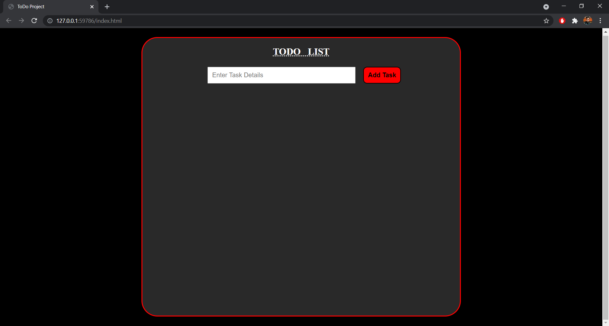
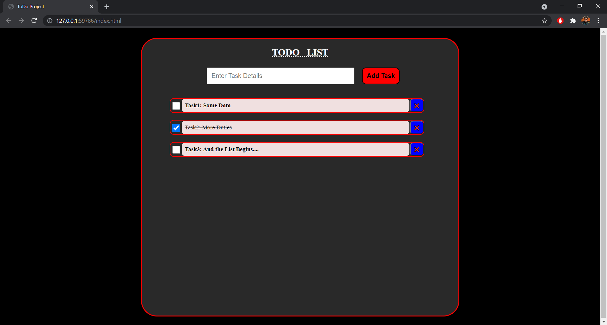

# TODO-WebApp

This is a simple TODO web application, made using HTML, CSS and Javascript.  
We can add tasks in it, mark them as done and can delete the same from the list.  

Check this out: **[Click Here](https://sumanksah.github.io/TODO-WebApp/)**

### Sample Images:

<table>
    <tr>
    <td> </td>
    <td> </td>
    </tr>
</table>